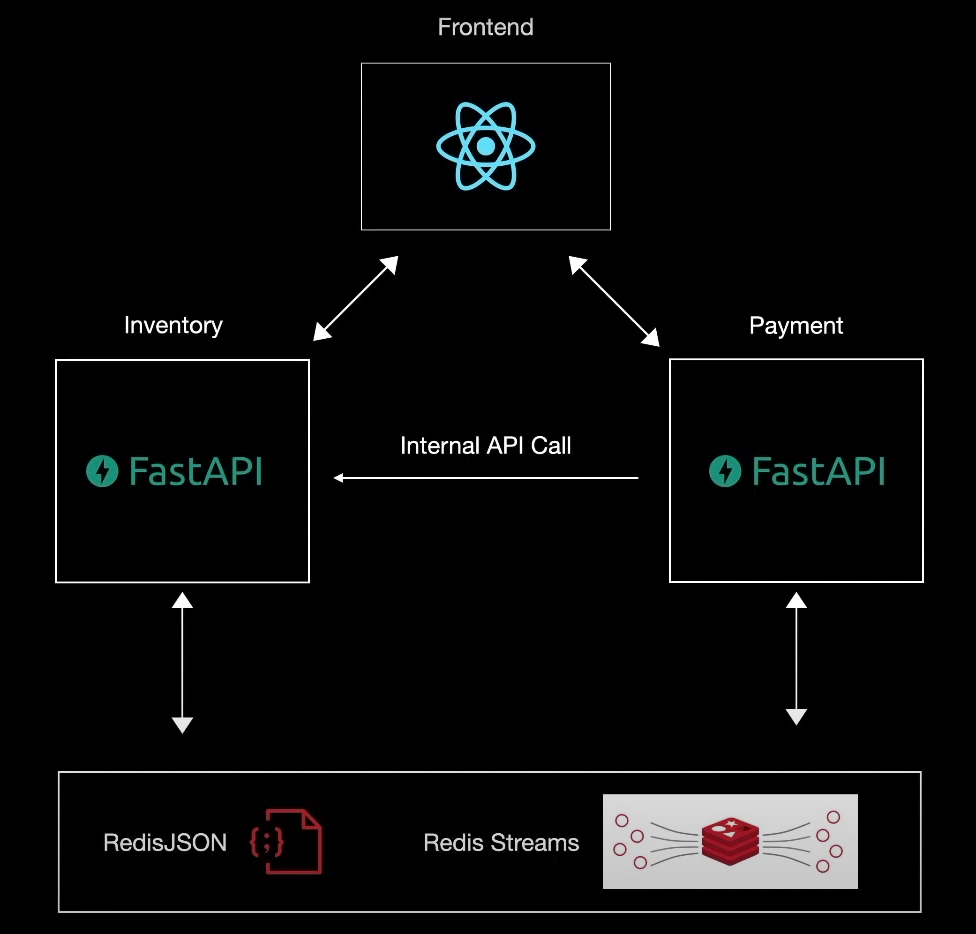

# Shipr 🚢

Shipr is a personal project aimed at helping folks understand distributed microservice architecture. It’s a simple, lightweight system designed to manage products, process orders, and handle payments.

## Shipr inventory service 📦

The **Inventory Service** is the backbone of Shipr's infrastructure, responsible for tracking product availability and stock management.

- **Main Application (`main.py`)**: The core of the inventory service, powered by FastAPI. It exposes RESTful APIs for CRUD oeprations.

- **Consumer (`consumer.py`)**: In conjunction with the main service, the consumer listens to Redis streams for updates on completed orders. When an order is processed, it adjusts inventory levels in real-time, ensuring that stock data is always accurate. In the event of an error, it triggers a refund process to maintain data integrity and customer satisfaction.

## Architecture



## Getting Started

### Prerequisites

- Python 3.x
- Redis

### Installation

As a best practice, it is advised to create a virtual environment to store this project's dependencies separately. You can install virtualenv with

1. Install virtualenv (optional)
    ```bash
    pip install virtualenv
    ```

2. Create env (optional)
   ```bash
   python -m venv .venv
   ```
3. Activate virtualenv (optional)
   ```bash
   source env/bin/activate
   ```
4. Install depndencies
    ```bash
    pip install -r requirements.txt
    ```
5. Make sure you have a `.env` file with following variables.
    ```
   # Redis configuration
   REDIS_HOST=xxx
   REDIS_PORT=xxx
   REDIS_DB=xxx

   # CORS configuration
   ALLOW_ORIGINS=xxx
   ALLOW_METHODS=xxx
   ALLOW_HEADERS=xxx
    ```
6. Run server
    ```bash
    uvicorn main:app
    ```
7. Run message consumer
    ```bash
    python consumer.py
    ```
