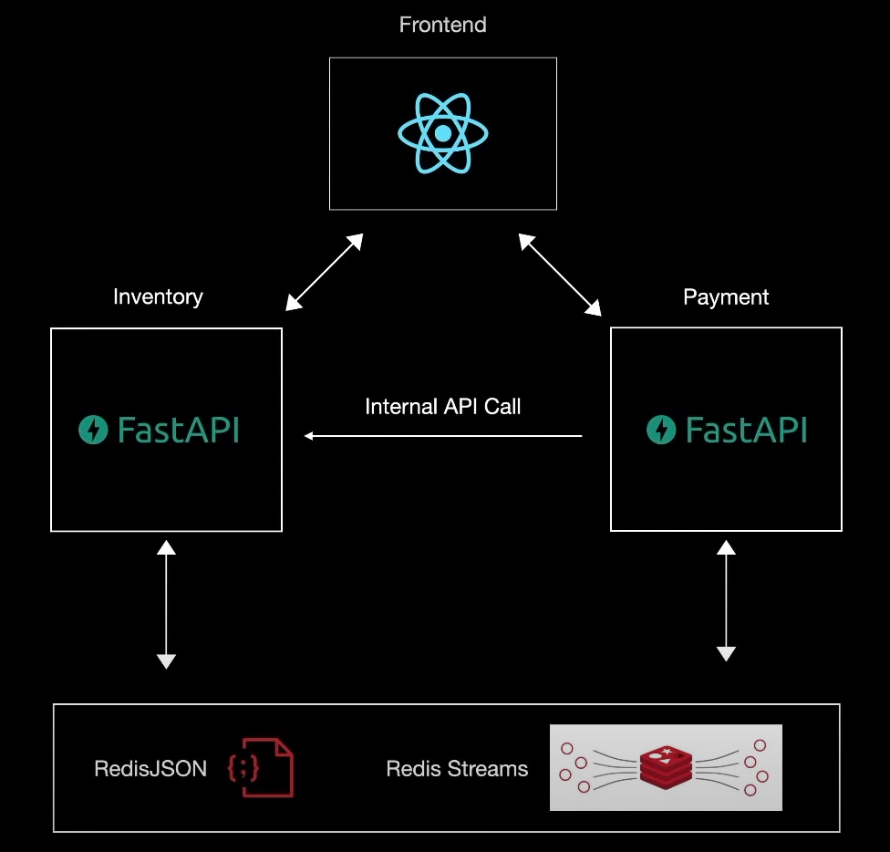

# Shipr 🚢

Shipr is a personal project aimed at helping folks understand distributed microservice architecture. It’s a simple, lightweight system designed to manage products, process orders, and handle payments.

## Shipr Payment serice 💸

The **Payment Service** handles the financial transactions that power Shipr.

- **Main Application (`main.py`)**: This service manages the core payment logic, including order creation, fee calculations, and total price determination.

- **Consumer (`consumer.py`)**: The payment service's consumer is dedicated to handling exceptions in the payment process, such as refund scenarios. It listens to a Redis stream and ensures that any issues with orders are addressed immediately, updating the status and refunding the payment as needed. This consumer helps maintain the consistency and reliability of the payment workflow.

## Architecture



## Getting Started

### Prerequisites

- Python 3.x
- Redis

### Installation

As a best practice, it is advised to create a virtual environment to store this project's dependencies separately. You can install virtualenv with

1. Install virtualenv (optional)
    ```bash
    pip install virtualenv
    ```

2. Create env (optional)
   ```bash
   python -m venv .venv
   ```
3. Activate virtualenv (optional)
   ```bash
   source env/bin/activate
   ```
4. Install depndencies
    ```bash
    pip install -r requirements.txt
    ```
5. Make sure you have a `.env` file with following variables.
    ```
   # Redis configuration
   REDIS_HOST=xxx
   REDIS_PORT=xxx
   REDIS_DB=xxx

   # CORS configuration
   ALLOW_ORIGINS=xxx
   ALLOW_METHODS=xxx
   ALLOW_HEADERS=xxx

   # Product service URL
   PRODUCT_SERVICE_URL=xxx

   # Fee percentage for orders
   FEE_PERCENTAGE=xxx
    ```
6. Run server
    ```bash
    uvicorn main:app
    ```
7. Run message consumer
    ```bash
    python consumer.py
    ```
